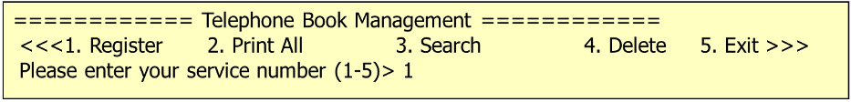
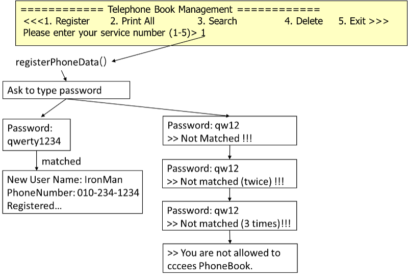
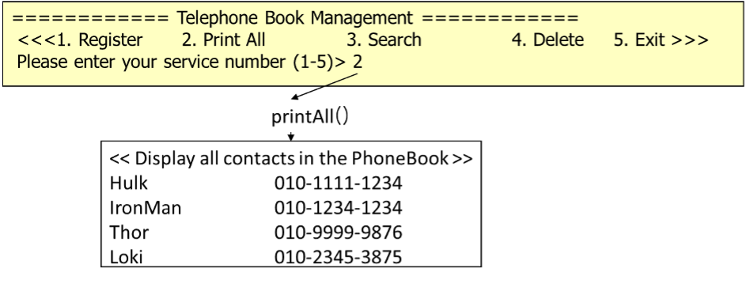
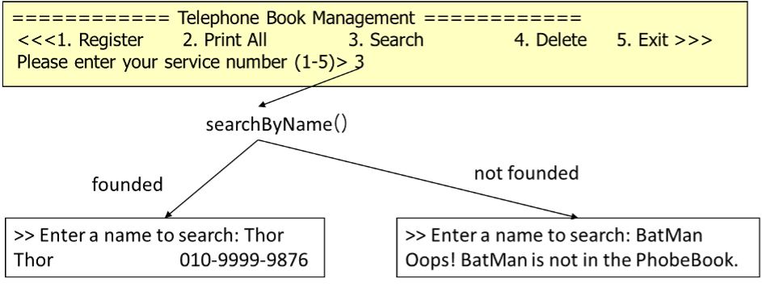
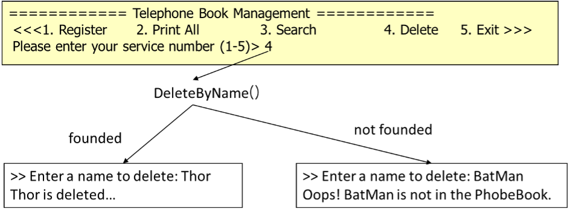

# 구조체 배열

## 내용
개인 정보 등록, 모든 정보 출력, 특정인의 정보 출력, 특정인의 정보 제거 기능을 가진 간단한 전화번호 관리 프로그램을 작성한다.

## 동작에 관하여

### 1. 동작 예시

(1) 메인 메뉴

프로그램을 실행하면, 아래 그림과 같이 5개의 메뉴 선택 화면을 출력한다. 

(2) Register 메뉴 선택 시 동작

(3) Print All 메뉴 선택 시 동작

(4) Search 메뉴 선택 시 동작

(5) Delete 메뉴 선택 시 동작

### 2. 조건
* 전화번호부에는 최대 50개의 정보를 저장할 수 있음
* 사용자가 그만하기를 선택할 때까지 여러 기능을 반복하여 처리할 수 있음
* 구조체 배열을 사용하여 구현하고, 필요하다면 구조체 포인터를 사용
* 전화번호부에 대한 자료구조를 저장하는 헤더화일 (phone.h) 사용
* 등록은 register.c, 전체 출력은 print.c, 특정인 검색은 search.c, 제거는 delete.c에  구체적인 기능을 구현.
* extern과 static 변수 사용.
