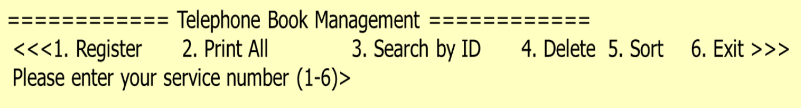
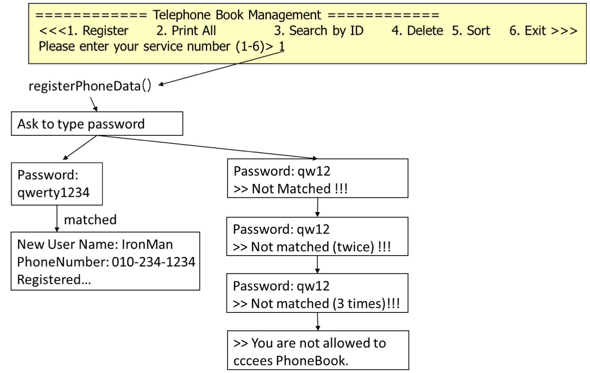
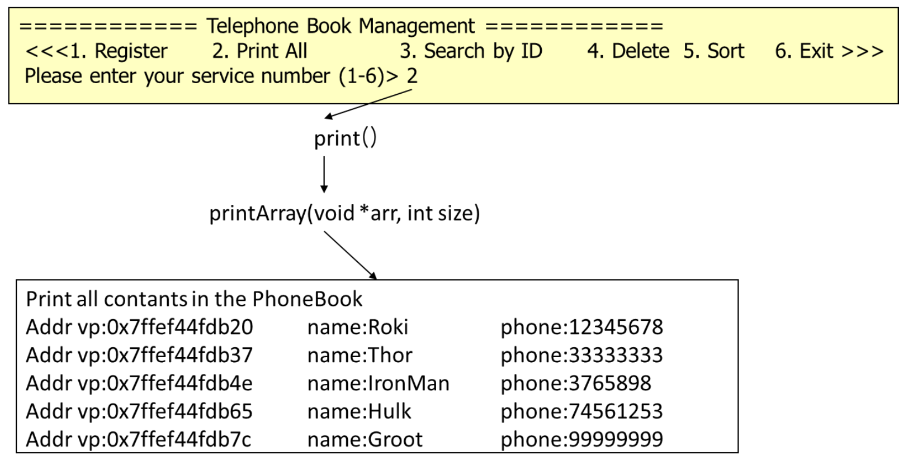
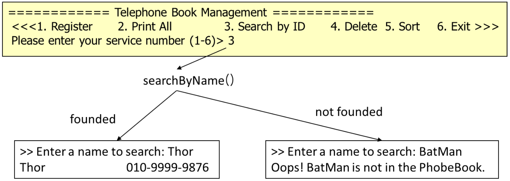
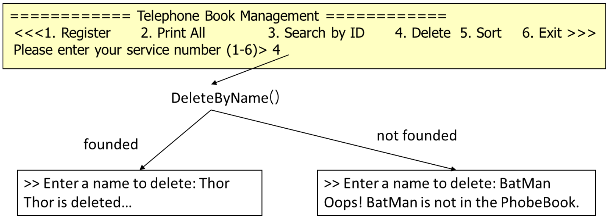
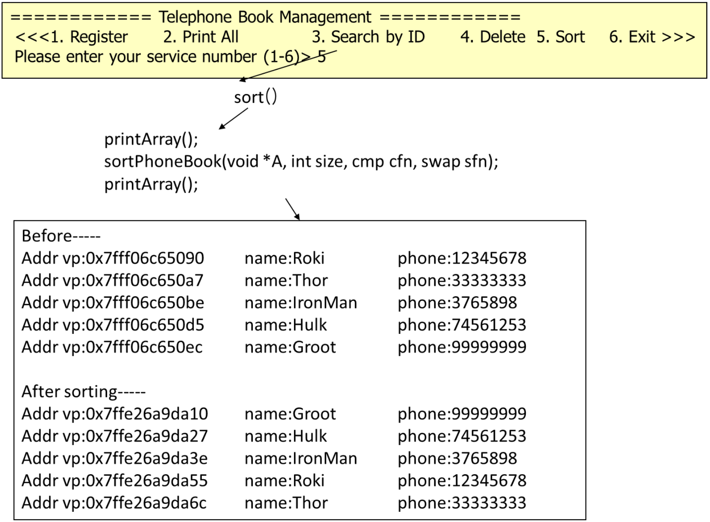

# 6. 함수 포인터와 void 포인터

## 내용
HW5의 프로그램에 함수 포인터를 사용하여 정렬 기능을 추가한다. 개인 정보 등록, 모든 정보 출력, 특정인의 정보 출력, 특정인의 정보 제거 기능, 정렬 기능을 가진 간단한 전화번호 관리 프로그램을 작성한다. 필요한 기능을 구현하면서 함수 포인터와 void 포인터의 사용법을 학습한다.

## 동작에 관하여

### 1. 동작 예시 

(1) 메인 메뉴

프로그램을 실행하면, 아래 그림과 같이 6개의 메뉴 선택 화면을 출력한다.

(2) Register 메뉴 선택 시 동작

(3) Print All 메뉴 선택 시 동작

- print(); 함수와 void printArray(void *arr, int size); 함수를 사용한다.

(4) Search 메뉴 선택 시 동작

(5) Delete 메뉴 선택 시 동작

(6) sort 메뉴 선택 시 동작

- sort() 함수 호출
- sort() 함수는 함수 포인터 2개를 인자로 받는 sortPhoneBook() 호출한다.

### 2. 조건 
- HW5에서 구현한 기능 중 필요한 함수들은 재사용한다.
- 정렬 기능을 동작을 위해서 필요한 함수를 구현한다.
- 전화번호부에 대한 자료구조를 저장하는 헤더화일 (phone.h) 사용한다.
- 등록은 register.c, 전체 출력은 print.c, 특정인 검색은 search.c, 제거는 delete.c, 정렬은 sort.c에 구체적인 기능을 구현한다.
- 함수 포인터와 void 포인터를 사용한다.