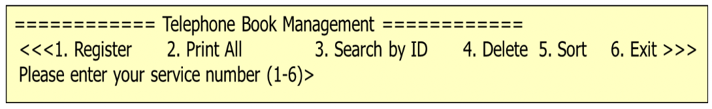
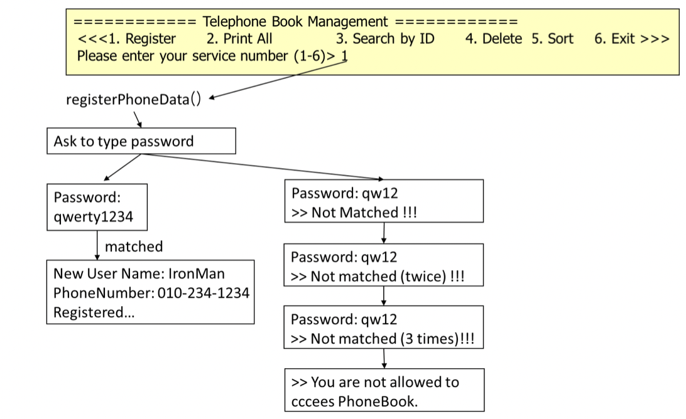
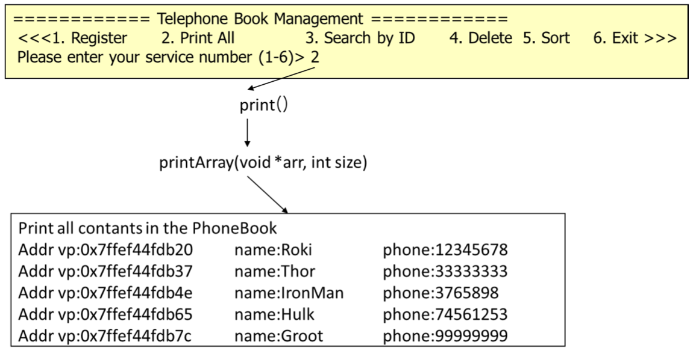
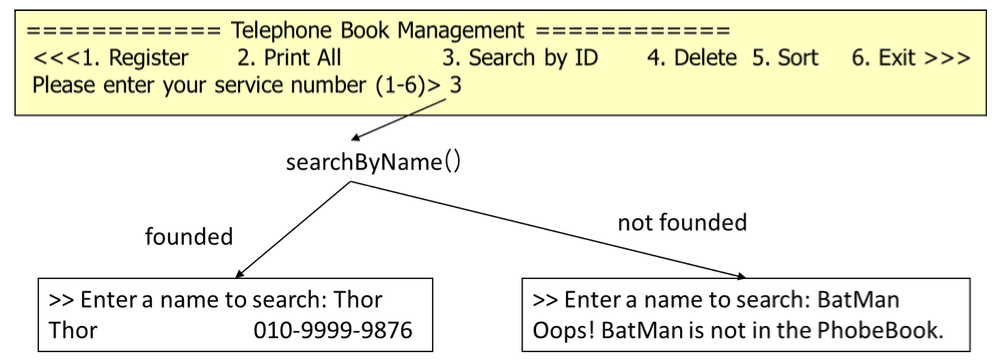
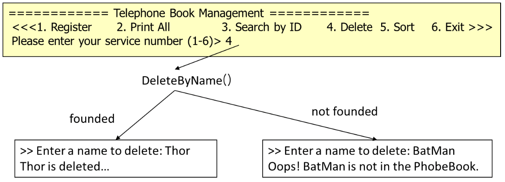
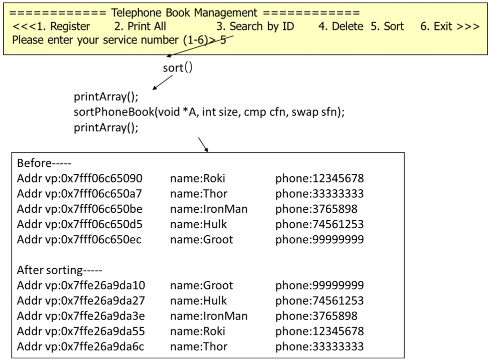

# 7. 자기 참조 구조체와 공유 라이브러리

## 내용
6에서 배열을 사용하여 구현한 전화번호부를, 자기 참조 구조체를 사용한 전화 번호부로 수정 한다. 전화번호 관리 프로그램은 개인 정보 등록, 모든 정보 출력, 특정인의 정보 출력, 특정인의 정보 삭제, 정렬 기능을 제공한다. 자기 참조 구조체를 이용한 연결 리스트 형태로 전화번호부를 정의하고, 메모리에 유지한다.

## 동작에 관하여

### 1. 동작 예시 

(1) 메인 메뉴

프로그램을 실행하면, 아래 그림과 같이 6개의 메뉴 선택 화면을 출력한다.

(2) Register 메뉴 선택 시 동작

(3) Print All 메뉴 선택 시 동작

(4) Search 메뉴 선택 시 동작

(5) Delete 메뉴 선택 시 동작

(6) sort 메뉴 선택 시 동작

### 2. 부가 설명

* 전화번호는 자기 참조 구조체를 이용하여, 연결 리스트 구조로 만든다.
* 전화번호부에 대한 자료구조를 저장하는 헤더파일 (phone.h) 사용한다.
* 동적 메모리 할당(malloc)과 해제(free) 함수를 이용한다.
* 등록은 register.c, 전체 출력은 print.c, 특정인 검색은 search.c, 제거는 delete.c, 정렬은 sort.c에 구체적인 기능을 구현한다.
* 위 그림의 전화번호 관리에 해당하는 Main()함수는 hw7Main.c에 구현함.
* 공유라이브러리 형식으로 컴파일하고 실행하는 Makefile을 작성한다. 즉 컴파일 시 -fPIC 옵션을 사용하고, 함수로 구현한 기능을 libhw7.so 라는 공유 라이브러리 형태로 컴파일한다. 
